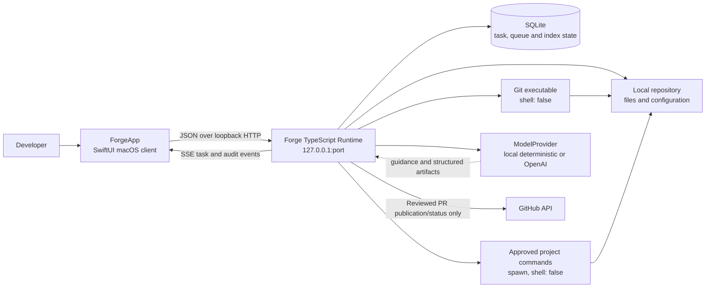
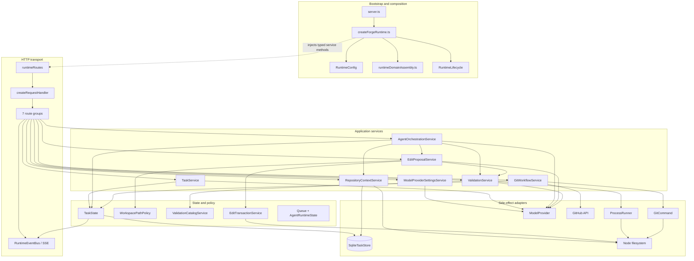
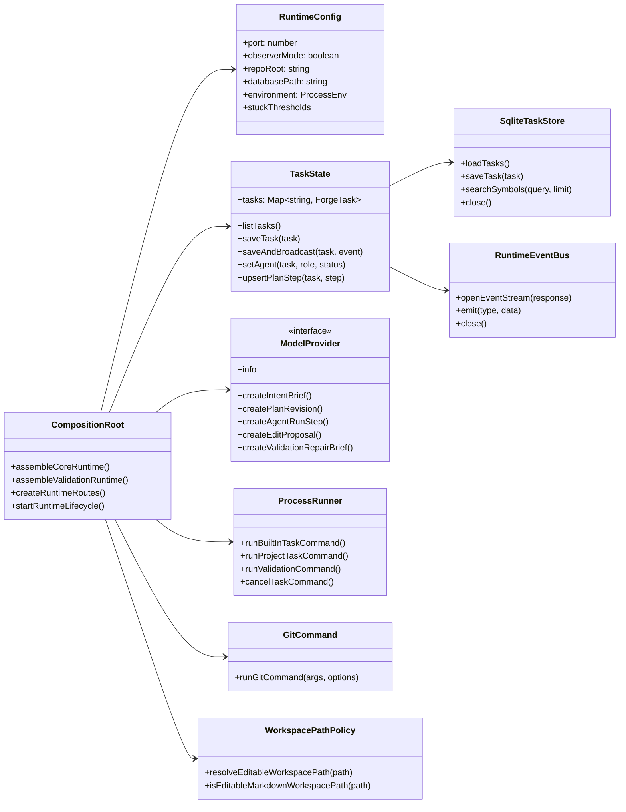
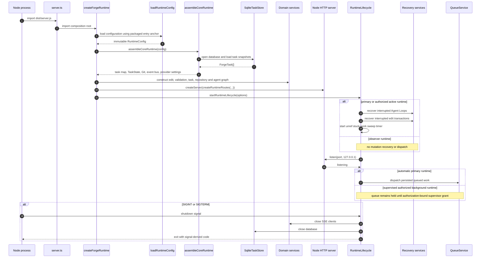
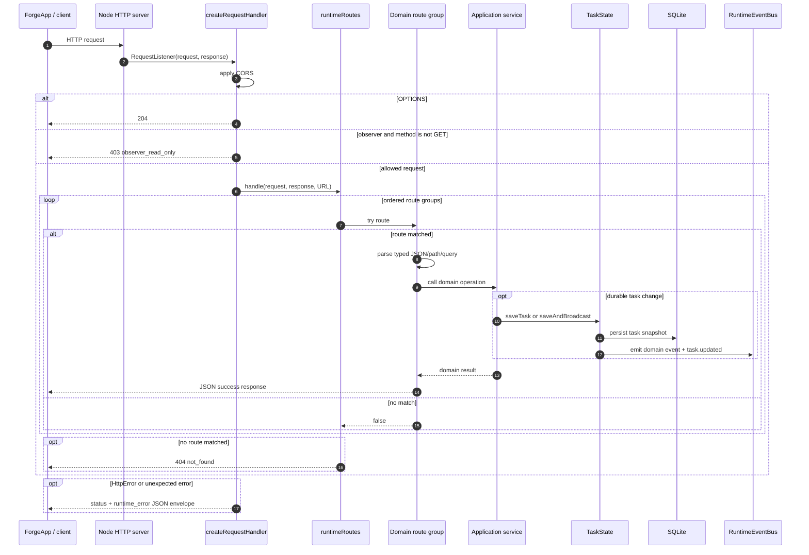
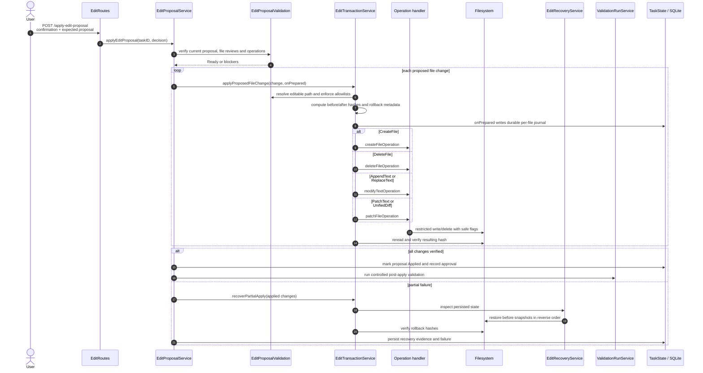
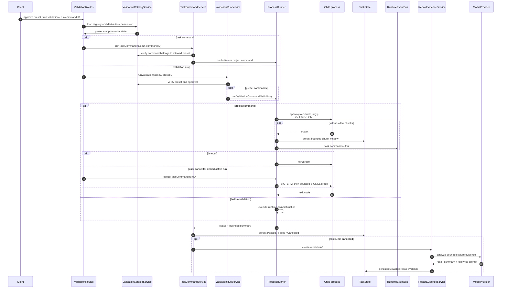
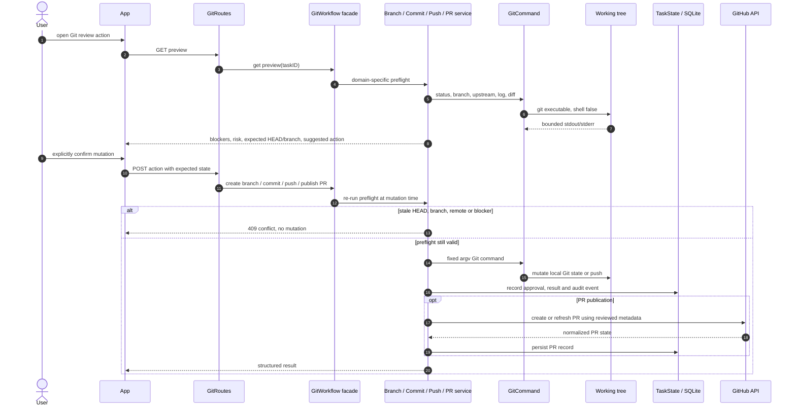
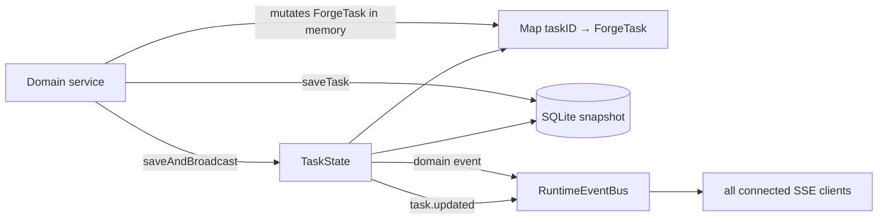
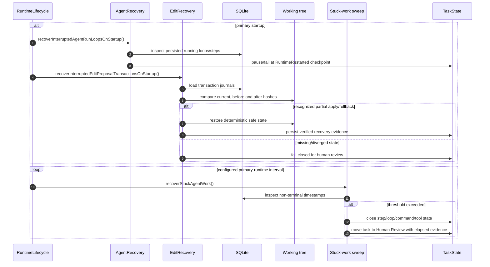

# Current Runtime Server Architecture

Document role: describe the runtime server as it exists after the server
decomposition and readability refactor. This document is the code-oriented
companion to `runtime_architecture.md`, which remains the source of truth for
runtime product behavior and trust rules.

Last verified against `main`: 2026-08-02, commit `56388dd`.

## Executive Summary

Forge's server is a local TypeScript process built directly on Node's HTTP,
filesystem, child-process, and SQLite APIs. It does not use Express, NestJS,
an ORM, or a dependency-injection framework. Composition is explicit:

1. `server.ts` imports the composition root.
2. `createForgeRuntime.ts` loads immutable configuration and constructs one
   runtime object graph.
3. Factory functions receive typed callbacks or narrow service interfaces.
4. `runtimeRoutes.ts` adapts HTTP requests to domain service calls.
5. `TaskState` persists task snapshots and publishes SSE events.
6. Narrow adapters own filesystem, Git, child-process, provider, and SQLite
   side effects.

The result is a modular monolith: one process and one repository per runtime,
with domain modules separated inside that process. The primary runtime may
mutate its repository. Observer runtimes open the same API in a read-only mode
that rejects every non-GET request before route dispatch.

### Reading Guide

| Question | Section |
| --- | --- |
| What talks to the runtime? | [System Context](#system-context) |
| Which source module owns each responsibility? | [Source Layout](#source-layout) |
| How do modules depend on one another? | [Component UML](#component-uml) |
| How are services created and cycles resolved? | [Composition Root And Dependency Wiring](#composition-root-and-dependency-wiring) |
| What happens during startup and shutdown? | [Startup And Shutdown Sequence](#startup-and-shutdown-sequence) |
| How does an HTTP request reach a service? | [HTTP Request Pipeline](#http-request-pipeline) |
| How does the Agent Loop work? | [Agent Loop And Step Execution](#agent-loop-and-step-execution) |
| How are file changes made safely? | [Edit Proposal Apply Transaction](#edit-proposal-apply-transaction) |
| How are commands and validation isolated? | [Validation And Task Command Execution](#validation-and-task-command-execution) |
| How are Git mutations protected? | [Git Review And Publication](#git-review-and-publication) |
| What survives restart? | [Persistence And Event Consistency](#persistence-and-event-consistency) and [Recovery And Watchdog Sequence](#recovery-and-watchdog-sequence) |
| Where should a future change go? | [How To Change The Server Safely](#how-to-change-the-server-safely) |

## System Context



Important context boundaries:

- The macOS app is a client, not the owner of runtime state.
- The runtime owns validation, approvals, expected-state checks, path policy,
  persistence, and all side effects.
- Model output can select or propose an action, but it cannot bypass runtime
  policy.
- Git and project commands are separate adapters. Neither accepts arbitrary
  shell strings from HTTP.
- GitHub publication is downstream of local Git review and explicit
  confirmation; credentials are not persisted in task state or URLs.

## Deployment Model

Each runtime process owns exactly one repository root and one loopback port.
The app normally supervises:

- one primary read-write runtime on the main runtime port;
- up to two additional repository runtimes in observer mode;
- an optional session-scoped promotion of one observer to an explicitly
  authorized active runtime.

The runtime is a modular monolith, not a distributed service system. Queue
serialization, transaction recovery, command cancellation, and SSE clients
are process-local; durable task and queue evidence is stored in SQLite so the
process can reconstruct safe state after restart.

## Source Layout

```text
runtime/src/
  server.ts                         packaged one-line bootstrap
  runtime/
    config.ts                       environment/config normalization
    createForgeRuntime.ts           composition root and server construction
    runtimeDomainAssembly.ts        core + validation assembly functions
    runtimeDomainDefaults.ts        repository/task/validation defaults
    lifecycle.ts                    listen, sweep, signal shutdown
    modelProviderSettingsService.ts provider selection and settings
  http/
    createRequestHandler.ts         CORS, OPTIONS, observer guard, error envelope
    runtimeRoutes.ts                seven-group route composer
    routes/                         system/task/agent/edit/validation/git/settings
    routeManifest.ts                explicit 65-route public contract
    request.ts, response.ts         JSON transport primitives
  tasks/
    taskState.ts                    persistence + event publication owner
    taskService.ts                  task, message, intent and plan operations
  agent/
    agentOrchestrationService.ts    facade
    queueService.ts                 durable scheduling
    agentLoopService.ts             bounded loop and controls
    agentStepService.ts             provider-selected safe step
    repositoryInspectionService.ts  bounded read-only inspection
    agentRecoveryService.ts         restart and stuck-work recovery
    agentRuntimeState.ts            active loop control map
  edits/
    editProposalService.ts          proposal/review/apply orchestration
    editProposalValidation.ts       preview-time policy checks
    editTransactionService.ts       journaling, verification, compensation
    createFileOperation.ts          create handler
    deleteFileOperation.ts          delete handler
    modifyTextOperation.ts          append/replace handler
    patchFileOperation.ts           patch/unified-diff handler
    editRecoveryService.ts          persisted transaction recovery
    workspacePathPolicy.ts          editable-path boundary
  validation/
    validationService.ts            facade
    processRunner.ts                child lifecycle, output, timeout, cancel
    taskCommandService.ts           approved task command orchestration
    validationRunService.ts         preset execution and built-in checks
    repairEvidenceService.ts        failure briefs and repair lineage
    validationCatalogService.ts     preset registry and permissions
  git/
    gitCommand.ts                   no-shell Git adapter
    gitStatusService.ts             status snapshot
    gitDiffService.ts               bounded diff preview
    gitConflictService.ts           conflict read/resolve/stage
    gitWorkflowService.ts           facade
    gitBranchService.ts             branch preview/create/switch
    gitBranchPublishService.ts      first publish/upstream
    gitCommitService.ts             commit preview/create
    gitPushService.ts               push preview/push
    gitPullRequestService.ts        PR preview/publish/status
  repository/
    repositoryContextService.ts     index/search/read context and logged tools
  events/runtimeEventBus.ts         SSE connection registry
  taskStore.ts                      SQLite adapter
  modelProvider.ts                  provider interface and implementations
  types.ts                          persisted/public runtime contracts
```

## Component UML

The following UML-style component diagram shows the dependency direction. A
solid arrow means a direct runtime call. A dashed arrow means construction or
callback injection at the composition root.



## Core Runtime Object Model

This class diagram describes the most important runtime-owned interfaces. The
implementation uses factory-returned objects rather than TypeScript classes;
the UML classes represent contracts and ownership, not literal `class`
declarations.



## Composition Root And Dependency Wiring

`createForgeRuntime.ts` is the only place that knows the complete service
graph. It performs these phases in order:

1. Load and normalize runtime configuration.
2. Assemble core state and adapters: event bus, Git adapter, SQLite store,
   task map, TaskState, basic Git services, and provider settings.
3. Create repository defaults and editable workspace policy.
4. Create edit validation, transaction, recovery, and proposal services.
5. Create validation defaults, validation services, and catalog services.
6. Create task and repository-context services.
7. Create Agent orchestration and the legacy compatibility loop.
8. Inject all public methods into the typed route composer.
9. Create the Node HTTP server and start lifecycle/recovery hooks.

### Intentional Deferred Bridges

Four dependency pairs need callbacks in both directions. They are resolved in
the composition root with deferred variables and narrow functions, not a
global service locator:

| Bridge | Why it exists | Safety property |
| --- | --- | --- |
| Edit transaction ↔ edit recovery | Transaction code needs persisted-state inspection; recovery needs transaction hashing/snapshot paths. | Only specific inspection/restore/hash callbacks cross the boundary. |
| Edit proposal ↔ validation | Applying a proposal triggers validation; validation repair needs proposal/run evidence. | Neither service imports the other module or HTTP. |
| Task service ↔ repository context | Plan construction needs bounded search/read; repository path resolution uses task-owned read policy. | Calls are injected as read-only, budgeted operations. |
| Agent loop/queue/step/inspection | Queue dispatch starts loops; loops invoke steps; inspection completes or blocks steps. | One explicit `AgentRuntimeState` owns active-loop controls; callbacks expose only required actions. |

Validation has a smaller internal bridge: `assembleValidationRuntime` creates
the service first with a deferred catalog loader, then creates the catalog with
permission queries supplied by the service.

This is hand-written dependency injection. The advantage is that every cycle
is visible at one assembly point. The cost is that additions to a broad route
or orchestration option type must be wired manually and covered by integration
tests.

## Startup And Shutdown Sequence



The packaged path anchor is deliberate. Although composition lives under
`runtime/`, configuration still resolves relative paths from `dist/server.js`
so packaged and development launches agree on the runtime directory.

## HTTP Request Pipeline



The observer guard is intentionally outside every route group. A POST cannot
reach JSON parsing or a domain service in observer mode. `HttpError` carries an
intentional status; other exceptions become status 500 with the same stable
error envelope.

## Route Groups

The route manifest contains 59 entries, including `OPTIONS /*`. The 58
GET/POST routes are owned by seven groups:

| Group | Count | Responsibilities | Representative paths |
| --- | ---: | --- | --- |
| System | 6 | home, health, index status/rebuild/search, SSE | `/`, `/health`, `/index`, `/index/rebuild`, `/index/symbols`, `/events` |
| Task | 8 | task list/detail/create, audit export, messages, plan generation/approval, cancellation | `/tasks`, `/tasks/:taskID`, `/audit-export`, `/generate-plan-revision`, `/approve-plan`, `/cancel` |
| Agent | 12 | queue settings/order/supervisor grant, approve-and-run, step/loop controls, stuck recovery | `/queue`, `/queue/dispatch-next`, `/approve-plan-and-run`, `/run-agent-step`, `/run-agent-loop`, `/pause-agent-loop`, `/abort-agent-loop`, `/resume-agent-loop` |
| Edit | 8 | proposal generation/revision/review/apply/rollback/reject | `/generate-edit-proposal`, `/review-edit-proposal-file`, `/apply-edit-proposal`, `/rollback-edit-proposal` |
| Validation | 7 | presets, permissions, validation, task command/rerun/cancel | `/validation-presets`, `/validation-permissions`, `/run-validation`, `/run-task-command`, `/rerun-repair-command`, `/cancel-task-command` |
| Git | 15 | status, diff, conflict, branch, commit, push and PR | `/git/status`, `/git/diff`, `/git/conflicts`, `/git/branch`, `/git/commit`, `/git/push`, `/git/pr-publish` |
| Settings | 2 | model-provider configuration | `/settings/model-provider` |

Route files contain transport adaptation only: method/path matching, typed
request decoding, query extraction, service invocation, and response status.
Approval and safety policy belongs to services, so alternate transports cannot
accidentally bypass it.

## Task To Approved Agent Loop

```mermaid
sequenceDiagram
    autonumber
    actor User
    participant App as ForgeApp
    participant TaskRoutes
    participant TaskService
    participant Provider as ModelProvider
    participant Repo as RepositoryContextService
    participant State as TaskState
    participant AgentRoutes
    participant Queue as QueueService
    participant Loop as AgentLoopService

    User->>App: create task with objective
    App->>TaskRoutes: POST /tasks
    TaskRoutes->>TaskService: createTask(input)
    TaskService->>Provider: create structured intent brief
    Provider-->>TaskService: brief, constraints, questions
    TaskService->>Repo: resolve references and bounded context
    TaskService->>State: saveAndBroadcast(task.created)
    TaskRoutes-->>App: 201 ForgeTask

    alt clarification required
        TaskService-->>App: Human Review / Clarification
        User->>App: answer question
        App->>TaskRoutes: POST /tasks/:id/messages
        TaskService->>Provider: update intent brief
    end

    TaskService->>Provider: create plan revision
    Provider-->>TaskService: structured plan
    TaskService->>State: persist reviewable plan
    User->>App: Approve & Run
    App->>AgentRoutes: POST /approve-plan-and-run
    AgentRoutes->>TaskService: approvePlan(current revision)
    TaskService->>Repo: bounded execution-context pass
    AgentRoutes->>Queue: scheduleAgentRunLoop(taskID, limits)

    alt repository slot available
        Queue->>Loop: runAgentLoop(taskID)
    else another loop owns repository
        Queue->>State: persist ordered queue request
        Queue-->>App: queued task snapshot
    end
```

Plan approval never implies edit apply, command approval, Git commit, push, or
PR permission. Those remain separate checkpoints.

## Agent Loop And Step Execution

```mermaid
sequenceDiagram
    autonumber
    participant Queue as QueueService
    participant Loop as AgentLoopService
    participant State as AgentRuntimeState
    participant Step as AgentStepService
    participant Provider as ModelProvider
    participant Inspect as RepositoryInspectionService
    participant Repo as RepositoryContextService
    participant Edit as EditProposalService
    participant Validation as ValidationService
    participant TaskState

    Queue->>Loop: runAgentLoop(taskID, maxSteps)
    Loop->>State: register active loop control
    Loop->>TaskState: persist loop Running

    loop until terminal reason or maxSteps
        Loop->>Step: runAgentStep(taskID, loopID)
        Step->>Provider: createAgentRunStep(context, permissions)
        Provider-->>Step: structured safe action decision

        alt malformed structured output
            Step->>Provider: one bounded correction request
            Provider-->>Step: corrected decision or final failure
        end

        alt InspectRepository
            Step->>Inspect: execute bounded inspection
            Inspect->>Repo: list/search/read through logged tools
            Repo-->>Inspect: context files + quality evidence
            Inspect-->>Step: completed or blocked step
        else GenerateEditProposal
            Step->>Edit: generate proposal only
        else RunTaskCommand
            Step->>Validation: run previously permitted command ID
        else GenerateRepairProposal
            Step->>Edit: generate review-only repair proposal
        else RerunRepairCommand
            Step->>Validation: rerun linked applied repair evidence
        else WaitForHumanReview
            Step->>TaskState: record blocked/review checkpoint
        end

        Step->>TaskState: persist decision, evidence and result
        Step-->>Loop: terminal or continuable result

        opt pause or abort requested
            Loop->>State: read cooperative control request
            Loop->>TaskState: stop after current safe step
        end
    end

    Loop->>State: remove active control
    alt automatic mode
        Loop->>Queue: dispatch next queued task
    else supervised mode
        Note over Loop,Queue: retain queue until POST /queue/dispatch-next
    end
```

The loop is bounded and cooperative. Pause/abort does not interrupt a
filesystem mutation halfway through; it is observed after the current safe
step. Repository serialization is enforced even if the global queue setting
is greater than one, because one runtime owns one working tree.

## Edit Proposal Apply Transaction



The journal is written before mutation. A process crash is handled during the
next primary startup: recovery compares current hashes with recorded
before/after hashes and only performs a deterministic restore when the state
is recognized. Diverged files fail closed for human review.

## Validation And Task Command Execution



`ProcessRunner` owns the active child map, output truncation, timeout, signal
escalation, and cancellation ownership. The command and validation services
own task state transitions and policy. Workspace preset configuration can only
refer to runtime-normalized executable/argument definitions; HTTP clients do
not submit raw shell commands.

## Git Review And Publication



The facade is only composition. Policy remains in five domain services. Force
push is not exposed. Conflict resolution stages one reviewed file and never
continues merge/rebase/cherry-pick automatically.

## Persistence And Event Consistency

`TaskState` is the normal mutation boundary for durable task state:



`saveAndBroadcast` appends the runtime event to the task, updates `updatedAt`,
stores the task, emits the domain event, and then emits `task.updated`. Some
high-frequency paths, especially command chunks, perform an explicit
save-plus-emit sequence to keep output streaming bounded and responsive. New
code should prefer the TaskState methods unless a documented high-frequency
path requires otherwise.

SQLite stores durable snapshots and repository index metadata. It is not an
event-sourced database: audit events live inside persisted tasks, while the
current task object is the authoritative reconstructed state.

## Recovery And Watchdog Sequence



Observer runtimes do not run mutation recovery, queue dispatch, or the stuck
work sweep. This prevents a read-only observer from rewriting task or working
tree state while the primary runtime is active.

Authorized Mission Control background runtimes do run recovery and the stuck
work sweep, but their queue service is configured `supervised`. Startup and
loop-finally calls become no-ops; only an exact session-authorization grant can
start the existing queue head. Thus recovery authority and scheduling
authority remain explicit and independently testable.

## Trust Boundaries And Invariants

### Transport boundary

- Listen only on configured loopback address and port.
- Apply CORS and stable JSON error envelopes in one request handler.
- Reject all observer non-GET requests before domain execution.
- Keep tokens out of query strings; sensitive publication data uses POST
  bodies and is not persisted as raw credentials.

### Model boundary

- Providers return structured briefs, plans, decisions, proposals, and repair
  guidance.
- Runtime schemas, enum checks, budgets, and one bounded correction attempt
  validate provider output.
- Provider output cannot create a raw process, write a file, apply a proposal,
  approve a command, or execute Git directly.

### Filesystem boundary

- Read-only and editable path resolvers are separate.
- Absolute paths, traversal, `.git`, `.forge`, secret/lock files, binary data,
  oversize files, and non-allowlisted extensions fail closed.
- Apply writes a durable journal before mutation, verifies after hashes, and
  compensates partial failure in reverse order.

### Process boundary

- Validation and project commands use executable plus argument arrays,
  `shell: false`, timeouts, bounded output, and runtime-owned run IDs.
- Cancellation only targets a child process registered by the current runtime.
- Git uses a separate no-shell adapter and exposes no force operations.

### State boundary

- Task changes are persisted with audit evidence.
- Queue order, approvals, plan revisions, command runs, edit journals, Agent
  steps/loops, and recovery results survive restart.
- In-memory active child/loop handles are deliberately not durable; startup
  recovery converts stale running state into safe human-review checkpoints.

## Concurrency Model

Node executes orchestration in one event loop, while filesystem, SQLite, Git,
provider HTTP, and child processes are asynchronous. The important locks are
logical rather than thread mutexes:

- one active Agent Loop per repository runtime;
- one running task command or validation run per task;
- active command children keyed by task-command run ID;
- active loop controls keyed by task ID/loop ID;
- expected HEAD, branch, proposal ID, file review, and hash checks prevent
  stale mutations;
- queue persistence serializes approved work across restarts.

An `await` is therefore a concurrency boundary. Mutation services re-check
expected state immediately before side effects instead of assuming the state
seen during preview is still current.

## How To Change The Server Safely

| Change | Primary module | Also review | Focused verification |
| --- | --- | --- | --- |
| Add or change an endpoint | matching `http/routes/*Routes.ts` | `routeManifest.ts`, observer availability | `smoke:http-contract` |
| Change task/plan behavior | `tasks/taskService.ts` | provider schemas, TaskState events | unit + `smoke:core` |
| Change Agent decisions/loop | `agentStepService.ts` or `agentLoopService.ts` | queue/recovery/inspection guard | core, queue, provider-recovery, stuck-recovery |
| Add edit operation | operation handler + proposal validation | path policy, journal, rollback/recovery | text/diff units + core |
| Add validation command | domain defaults/catalog | ProcessRunner policy and permissions | validation unit + core + stuck-recovery |
| Change Git mutation | one Git domain service | parser/preflight/approval evidence | Git-focused smoke scripts |
| Change persistence/events | `taskState.ts` or `taskStore.ts` | observer reload and SSE | task-store + HTTP/SSE contract + core |
| Change startup/recovery | `lifecycle.ts` or recovery service | observer mode and queue dispatch | observer, queue, stuck-recovery, core restart |

Full compatibility gate:

```bash
cd runtime
npm run check
npm run build
npm run test:unit
npm run coverage:unit
npm run smoke:all
cd ..
swift test
```

## Known Architectural Edges

- `createForgeRuntime.ts` is still the broadest reader of the whole graph. It
  is intentionally a composition root, but new domain behavior should not be
  added there.
- `GitPullRequestService` is cohesive but remains the largest post-refactor Git
  service because it owns preview, publish, remote normalization, API payload,
  task persistence, and status refresh. Split it only along a stable policy vs
  GitHub-adapter boundary.
- `EditProposalService` still coordinates a wide lifecycle. Operation details
  and transaction safety are already outside it; further splitting should
  preserve one owner for proposal state transitions.
- `LegacyAgentLoopService` remains as a compatibility path. New autonomous
  behavior belongs in the bounded queue/loop/step services.
- Route option typing currently intersects the public surfaces of several
  services. Route groups should continue to use only their required methods;
  a generic mutable service bag must not emerge.

## Architectural Decision Summary

The runtime favors explicitness over framework abstraction:

- modular monolith over distributed services;
- Node HTTP primitives over a web framework;
- factory functions and typed callback injection over a DI container;
- SQLite task snapshots plus embedded audit events over event sourcing;
- runtime-owned policies over trusting client or model decisions;
- previews, confirmations, expected-state checks, journals, and recovery over
  optimistic unguarded mutation;
- focused unit tests plus executable HTTP and smoke contracts over structural
  refactors without behavioral evidence.

This architecture is designed so a reviewer can start at one route group,
follow one service boundary to its adapters, identify the human approval and
expected-state gates, and run the matching focused fixtures without reading a
single monolithic server file.
